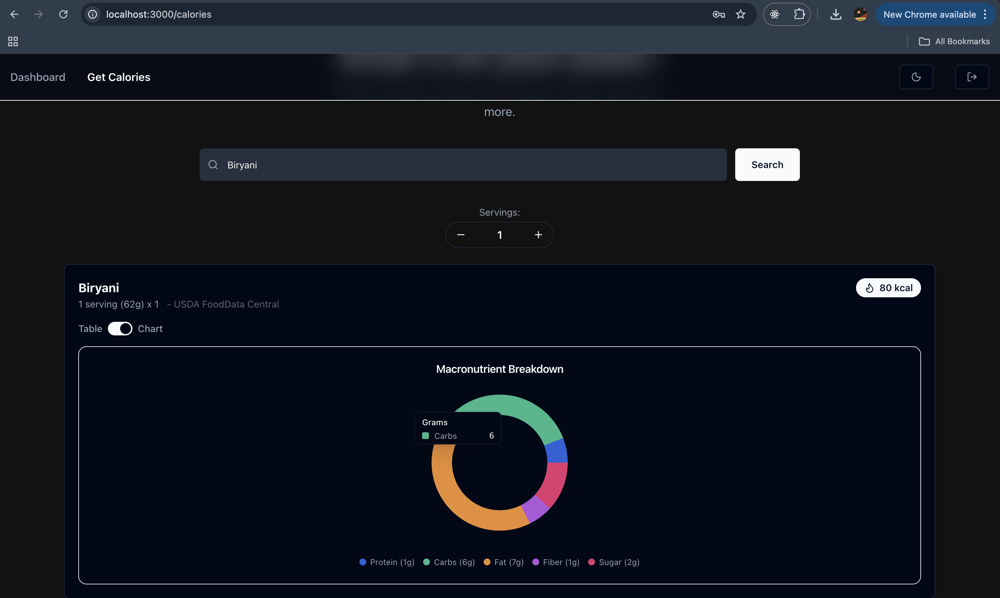
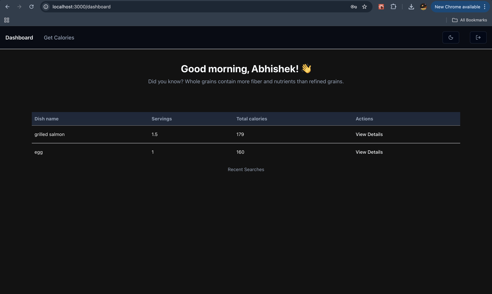
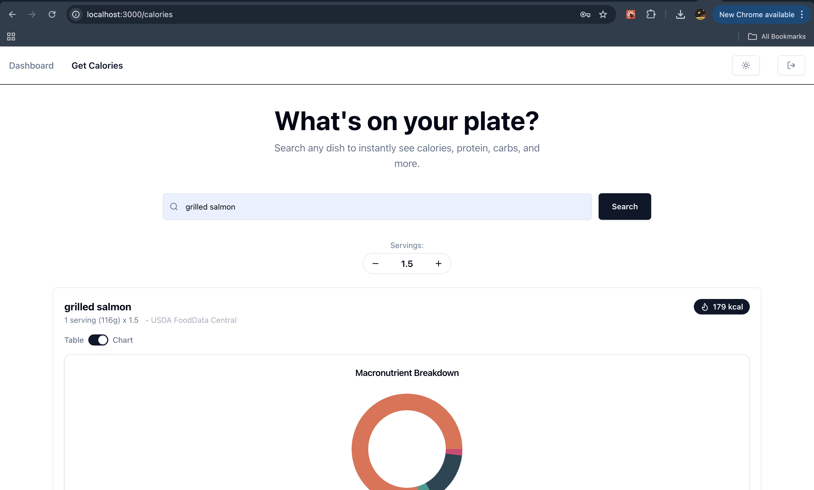
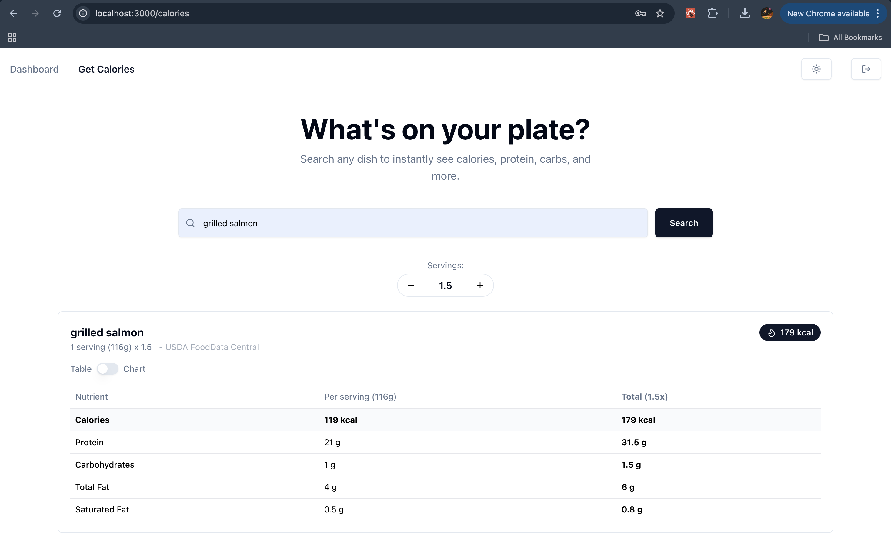
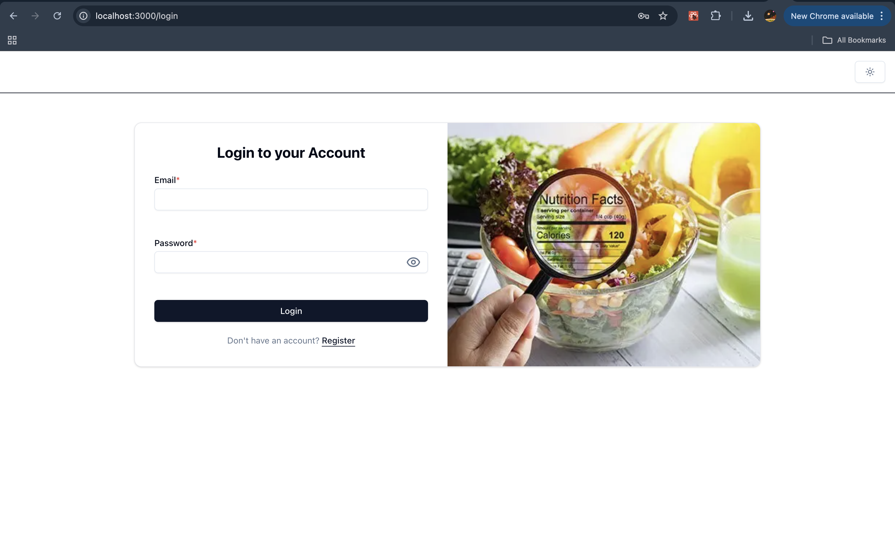
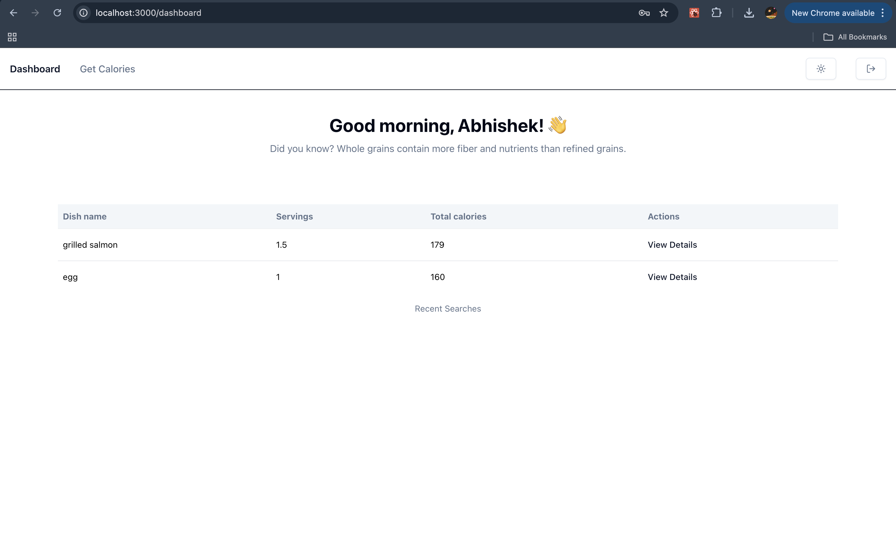
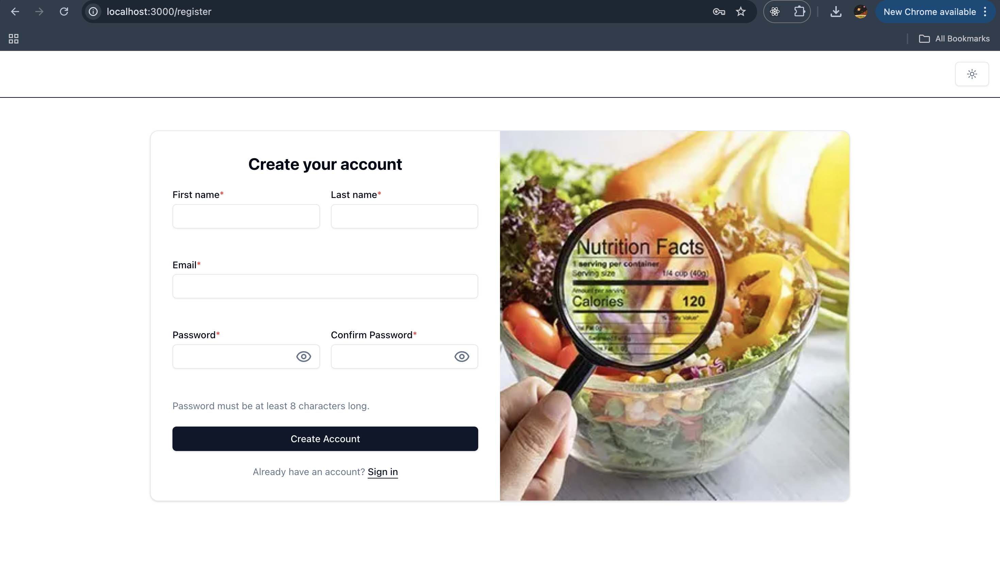

# meal-calorie-frontend-abhishek

A brief description of what this project does and who it's for

## Deployed URL

[Preview](https://meal-calorie-frontend-abhishek-nu.vercel.app/)

## Tech Stack

### Frontend

- Next.js 14
- React 18
- TypeScript

### State Management

- Zustand (with persist middleware)

### Data Fetching & API Management

- TanStack React Query

### Forms & Validation

- React Hook Form
- Zod

### UI & Styling

- Tailwind CSS
- ShadeCn
- Lucide Icons
- Recharts (Data visualization)

### Authentication

- JWT decoding using jwt-decode

### Testing

- Vitest
- React Testing Library
- Jest DOM

### Developer Tooling

- ESLint
- PostCSS
- TypeScript

### DevOps & Environment

- Docker
- Environment variables via `.env.local`

### 3. Configure Environment Variables

Create a `.env.local` file in the root directory.

You can copy the example file:

```
cp .env.example .env.local
````

---

### 4. Run the Development Server

```bash
npm run dev
```

The application will start at:

```
http://localhost:3000
```
---

### Running with Docker

Build and run the container:

```
docker compose up --build
```

---

### Running Tests

Run unit tests using:

```
npm run test
```

---

## Architecture

Learn more about the system architecture in:

```
ARCHITECTURE.md
```
---
## Screenshots















